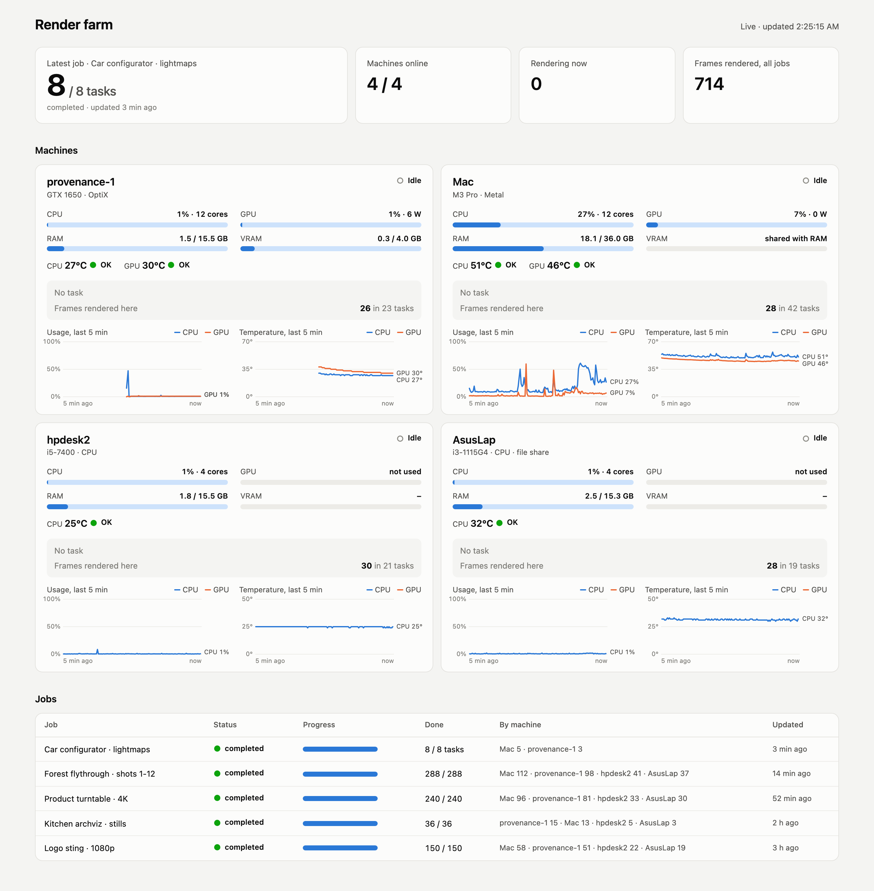

# Flamenco farm monitor

A small live dashboard for a [Blender Flamenco](https://flamenco.blender.org/) render farm: what every
machine is doing right now, and how hard it is working.

**Per machine**
- CPU, GPU, RAM and VRAM usage, CPU and GPU temperature (with OK / Warm / Hot / Critical status)
- the job and task it is running, the current frame, sample count and time left (parsed from the
  Blender log), or a stage such as "Loading scene…" / "Baking …" for tasks that are not frame renders
- frames rendered on that machine, and 5-minute usage and temperature charts with hover readouts

**Farm-wide**: machines online, how many are rendering, frames rendered, and a jobs table with
progress and the split of frames (or tasks) per machine.

It is one stdlib-only Python file and one HTML page. Nothing is installed on the workers.

## How it gets the numbers

| Source | How |
|---|---|
| Linux workers | `probe_linux.py` is piped over ssh (`ssh host python3 -u -`) and prints a JSON line every 2 s: `/proc/stat`, `/proc/meminfo`, hwmon `coretemp`, and `nvidia-smi` when present |
| The Mac (Apple Silicon) | [`macmon`](https://github.com/vladkens/macmon) `pipe`, which reads temperatures and CPU/GPU residency without sudo (`brew install macmon`) |
| Flamenco | the Manager REST API: workers, their current task, jobs, tasks, and each active task's log tail |

The page polls `/api/state` every 2 s. Intel iGPUs have no sudo-free utilisation counter, so a machine
without an NVIDIA GPU shows GPU as "not used".

## Setup

1. Workers need key-based ssh from the machine running the monitor, and `python3`.
2. `cp farm.example.json farm.json` and list your machines. `worker` must match the name the machine
   has in Flamenco; leave out `ssh` for the machine the monitor runs on (it uses `macmon`).
3. `python3 server.py` and open `http://<host>:8091`.

To keep it running on a Mac, a LaunchAgent works well. Point it at `/usr/bin/python3`, not Homebrew's
Python: macOS Local Network privacy silently blocks a launchd-started Homebrew Python from reaching
other LAN machines ("No route to host"), while Apple's own binary is allowed.

## Showing progress for your own scripts

Frame renders are picked up from Blender's `Fra:` / `Sample` log lines. For script tasks (bakes,
exports, anything run with `--python`), print a line starting with `STAGE ` and the dashboard shows
the rest of the line as the task's current stage.

## Licence

MIT
