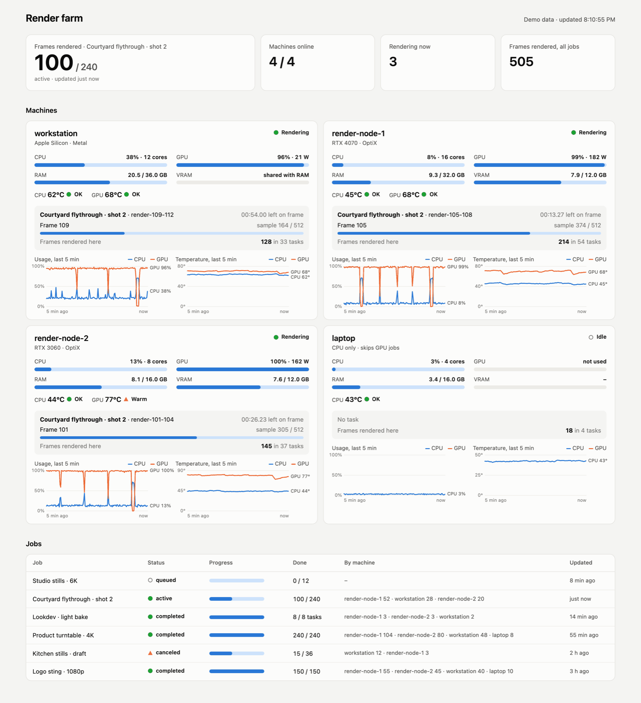
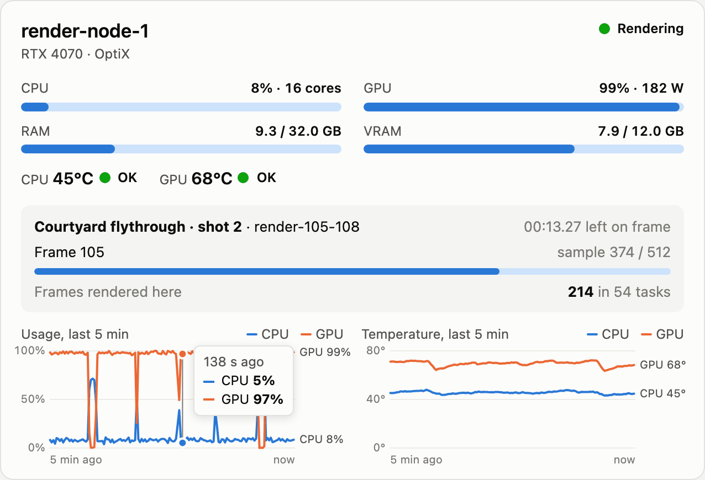
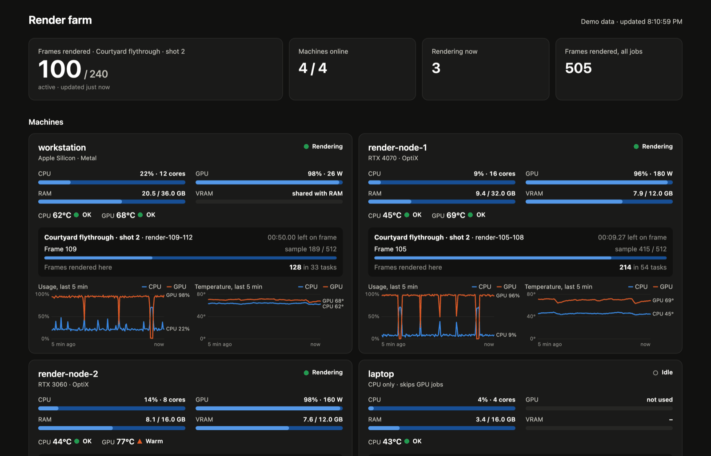
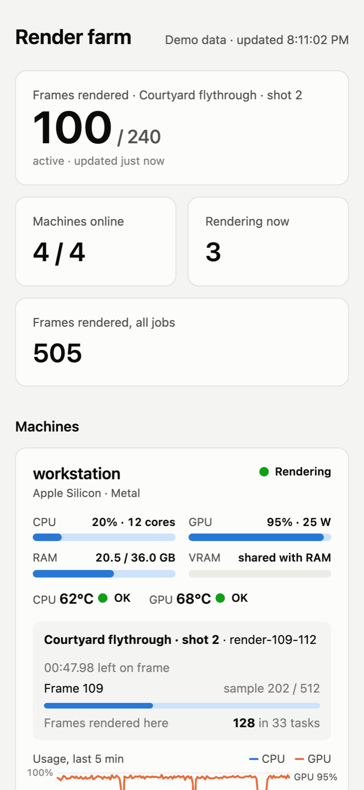
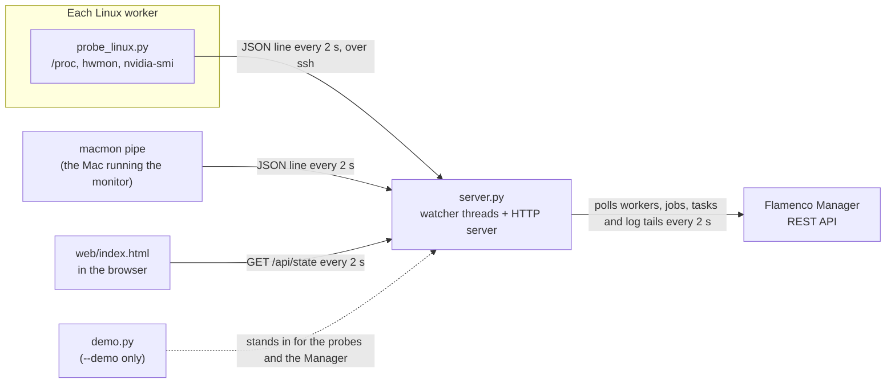

# Flamenco farm monitor

A small live dashboard for a [Blender Flamenco](https://flamenco.blender.org/) render farm: what every
machine is doing right now, and how hard it is working.

It is meant for a home or small-studio farm made of whatever machines are to hand (a desktop with a
good GPU, an older PC, a laptop, the Mac you work on). Flamenco's own web interface tracks jobs and
tasks, but it does not show how busy or how hot each machine is, and the progress inside a frame
(sample count, time left) is only visible by reading the task log. This page puts all of that on one
screen and refreshes every 2 seconds.

It is plain Python (standard library only) and one HTML page. Nothing is installed on the workers,
and there is no build step.

## Screenshots

All screenshots use the built-in demo mode (`--demo`), so the machines and jobs are made up.



*The full page. Three machines are rendering a job, the laptop sits out GPU-only jobs, and the GPU on
render-node-2 is running warm.*



*A machine card: live meters, temperature status, the frame being rendered with its sample count and
time left, and 5-minute charts with a hover readout.*



*Dark mode follows the system setting.*



*On a phone the cards stack into one column.*

## Features

**Per machine**
- CPU, GPU, RAM and VRAM usage, CPU and GPU temperature (with OK / Warm / Hot / Critical status)
- the job and task it is running, the current frame, sample count and time left (parsed from the
  Blender log), or a stage such as "Loading scene…" / "Baking …" for tasks that are not frame renders
- frames rendered on that machine, and 5-minute usage and temperature charts with hover readouts

**Farm-wide**: machines online, how many are rendering, frames rendered, and a jobs table with
progress and the split of frames (or tasks) per machine.

**Also**: a demo mode that needs no farm, light and dark themes, a layout that works on a phone, and a
banner when the Flamenco Manager cannot be reached (the last known picture stays on screen).

## Running it

You need Python 3.8 or newer. Only the standard library is used, so there is nothing to `pip install`.
On a Mac, Apple's `/usr/bin/python3` is fine.

### Try it without a farm

```sh
git clone https://github.com/LBSiUK/flamenco-farm-monitor.git
cd flamenco-farm-monitor
python3 server.py --demo
```

Then open <http://localhost:8091>. The demo farm has four fictional machines working through a
240-frame job; frames, samples, temperatures and the jobs table keep moving, and new jobs are queued as
old ones finish. If port 8091 is taken, add `--port 8092` (or any free port).

### On a real farm

What the monitor needs:

- **A Flamenco 3 Manager** reachable over HTTP (the monitor uses its `/api/v3` REST API, read only).
- **Linux workers**: key-based ssh from the machine running the monitor, with no passphrase prompt
  (it runs ssh with `BatchMode=yes`), and `python3` on the worker. `nvidia-smi` is used when present.
- **The Mac running the monitor** (optional, Apple Silicon): [`macmon`](https://github.com/vladkens/macmon),
  which reads temperatures and CPU/GPU residency without sudo: `brew install macmon`.

Then:

1. `cp farm.example.json farm.json` and list your machines (see below). `farm.json` is gitignored.
2. `python3 server.py` and open `http://<host>:8091`.

`python3 server.py --help` lists the options. `--port` overrides the port, and the `FARM_CONFIG`
environment variable points at a config file somewhere other than `./farm.json`.

`farm.json` fields:

| Field | Meaning |
|---|---|
| `port` | Port to serve on (optional, default 8091) |
| `manager` | The Flamenco Manager's base URL, for example `http://manager.local:8080` |
| `machines[].key` | A short unique id for the machine |
| `machines[].label` | The name shown on the card |
| `machines[].worker` | The machine's worker name in Flamenco (this is how metrics and tasks are matched up) |
| `machines[].ssh` | `user@host` for a Linux worker. Leave it out for the Mac the monitor runs on, which is read with `macmon` |
| `machines[].role` | Free text shown under the name, for example `RTX 3060 · OptiX` |

### Keeping it running on a Mac

A LaunchAgent works well. Point it at `/usr/bin/python3`, not Homebrew's Python: macOS Local Network
privacy silently blocks a launchd-started Homebrew Python from reaching other LAN machines ("No route
to host"), while Apple's own binary is allowed. A minimal agent, saved as
`~/Library/LaunchAgents/local.farm-monitor.plist` (adjust the paths):

```xml
<?xml version="1.0" encoding="UTF-8"?>
<!DOCTYPE plist PUBLIC "-//Apple//DTD PLIST 1.0//EN" "http://www.apple.com/DTDs/PropertyList-1.0.dtd">
<plist version="1.0">
<dict>
  <key>Label</key><string>local.farm-monitor</string>
  <key>ProgramArguments</key>
  <array>
    <string>/usr/bin/python3</string>
    <string>/path/to/flamenco-farm-monitor/server.py</string>
  </array>
  <key>RunAtLoad</key><true/>
  <key>KeepAlive</key><true/>
  <key>StandardOutPath</key><string>/path/to/flamenco-farm-monitor/monitor.log</string>
  <key>StandardErrorPath</key><string>/path/to/flamenco-farm-monitor/monitor.log</string>
</dict>
</plist>
```

Load it with `launchctl bootstrap gui/$(id -u) ~/Library/LaunchAgents/local.farm-monitor.plist`.
launchd's `PATH` does not include `/opt/homebrew/bin`, so the monitor also looks for `macmon` there.

### Showing progress for your own scripts

Frame renders are picked up from Blender's `Fra:` / `Sample` / `Remaining:` log lines (both the
Blender 5 format and the older one without spaces). For script tasks (bakes, exports, anything run with
`--python`), print a line starting with `STAGE ` and the dashboard shows the rest of the line as the
task's current stage.

### Tests

```sh
python3 -m unittest discover tests
```

They cover frame counting, Blender log parsing and the demo farm, and start `server.py --demo` on a
free port to check the page and `/api/state`. No farm or network access is needed.

## How it works



`server.py` starts one thread per machine and one for Flamenco, and keeps everything in memory:

| Source | How |
|---|---|
| Linux workers | `probe_linux.py` is piped over ssh (`ssh host python3 -u -`) and prints a JSON line every 2 s: `/proc/stat`, `/proc/meminfo`, hwmon `coretemp` / `k10temp`, and `nvidia-smi` when present. If ssh drops, the card shows the error and the watcher reconnects after 5 s |
| The Mac (Apple Silicon) | `macmon pipe` gives CPU and GPU residency, temperatures, GPU power and memory |
| Flamenco | the Manager REST API: workers and their current task, jobs and their tasks, and the log tail of each active Blender task, which is parsed for the frame, sample and time left |

Each machine keeps 5 minutes of samples (150 at 2 s) for the charts. Jobs are summarised into frames
done per job and per machine; frame counts come from task names such as `render-1-4`, and video
encoding tasks are left out. `/api/state` returns one JSON snapshot of all of this, and the page
redraws from it every 2 s. Everything else is served as static files from `web/`.

In demo mode nothing runs over ssh and no request goes to a Manager. `demo.py` simulates the machines
and answers the same Manager API calls (and writes Blender-style log tails), so the demo runs through
the real job summary and log parsing code.

### Project layout

| Path | What it is |
|---|---|
| `server.py` | The monitor: config loading, watcher threads, job summary, log parsing, HTTP server |
| `probe_linux.py` | Sent to each Linux worker over ssh on every connect; prints metrics as JSON lines |
| `demo.py` | The made-up farm behind `--demo` |
| `web/index.html` | The whole dashboard: HTML, CSS and plain JavaScript with inline SVG charts |
| `farm.example.json` | Template for your `farm.json` |
| `tests/` | `unittest` tests |
| `docs/screenshots/` | The images in this README |

## Limitations

- Machines are sampled on Linux (over ssh) or on the Apple Silicon Mac the monitor runs on. Windows
  workers and Intel Macs have no probe yet.
- Intel iGPUs have no sudo-free utilisation counter, so a machine without an NVIDIA GPU shows GPU as
  "not used". CPU temperature is read from the `coretemp`, `k10temp` or `acpitz` hwmon sensors.
- There is no login. The server listens on all interfaces, so keep it on a network you trust.
- History lives in memory only, so the charts start empty after a restart. The jobs table shows the 15
  most recent jobs.
- Live frame progress depends on Blender's log format. It was checked against Blender 5.2 output and
  the older 4.x line format.

## Licence

MIT
